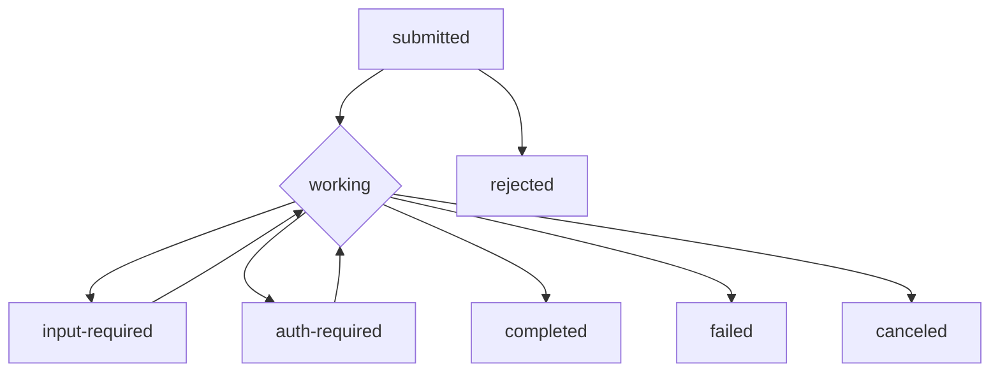

# A2A 协议技术研究 - 2026-03-02

## 📋 核心答案

**A2A (Agent2Agent)** 是由 **Google Cloud 发起**、现由 **Linux Foundation 托管** 的开放协议标准，旨在实现不同 AI 智能体之间的通信和互操作性 [[1]](https://a2a-protocol.org/dev/specification/)。

协议采用 **HTTP(S) + JSON-RPC 2.0** 作为基础传输层，支持 **Server-Sent Events (SSE)** 流式通信，使异构智能体能够无需暴露内部状态即可安全协作 [[2]](https://github.com/google/a2a/blob/main/docs/specification.md)。

---

## 💡 详细说明

### 1. 协议架构

#### 核心组件

| 组件 | 说明 |
|------|------|
| **Agent Card** | JSON 元数据文档，描述智能体身份、能力、技能和认证要求 [[3]](https://context7.com/google/a2a/llms.txt) |
| **Task** | 工作的基本单元，具有唯一 ID 和定义的生命周期状态 [[3]](https://context7.com/google/a2a/llms.txt) |
| **Skills** | 智能体对外提供的可调用能力，带输入/输出模式定义 [[3]](https://context7.com/google/a2a/llms.txt) |
| **Context** | 可选的服务器生成标识符，用于逻辑分组相关任务 [[2]](https://github.com/google/a2a/blob/main/docs/specification.md) |

#### 设计原则

- **简单性**: 基于 HTTP、JSON-RPC、SSE 等现有标准 [[2]](https://github.com/google/a2a/blob/main/docs/topics/what-is-a2a.md)
- **企业就绪**: 支持 OAuth2、OpenID Connect、API Keys 等标准认证 [[4]](https://github.com/google/a2a/blob/main/docs/topics/enterprise-ready.md)
- **异步支持**: 原生支持长时间运行任务和流式更新 [[2]](https://github.com/google/a2a/blob/main/docs/topics/what-is-a2a.md)
- **不透明执行**: 智能体协作无需暴露内部逻辑或专有工具 [[2]](https://github.com/google/a2a/blob/main/docs/topics/what-is-a2a.md)

---

### 2. 任务生命周期

#### 状态机



**状态说明** [[3]](https://context7.com/google/a2a/llms.txt):

| 状态 | 类型 | 说明 |
|------|------|------|
| `submitted` | 初始 | 任务已提交等待处理 |
| `working` | 处理中 | 任务正在执行 |
| `input-required` | 中断 | 需要用户输入才能继续 |
| `auth-required` | 中断 | 需要额外认证才能继续 |
| `completed` | 终端 | 任务成功完成 |
| `failed` | 终端 | 任务遇到错误终止 |
| `canceled` | 终端 | 任务被用户取消 |
| `rejected` | 终端 | 智能体拒绝处理任务 |

---

### 3. 核心 API 端点

#### 消息通信

| 端点 | 方法 | 说明 |
|------|------|------|
| `/a2a/message/send` | POST | 发送消息启动或继续任务 [[2]](https://github.com/google/a2a/blob/main/docs/specification.md) |
| `/a2a/message/stream` | POST | 发送消息并订阅 SSE 实时更新 [[2]](https://github.com/google/a2a/blob/main/docs/specification.md) |

#### 任务管理

| 端点 | 方法 | 说明 |
|------|------|------|
| `/a2a/tasks/get` | POST | 获取任务当前状态 [[2]](https://github.com/google/a2a/blob/main/docs/specification.md) |
| `/a2a/tasks/list` | POST | 获取任务列表（支持过滤和分页）[[2]](https://github.com/google/a2a/blob/main/docs/specification.md) |
| `/a2a/tasks/cancel` | POST | 请求取消运行中的任务 [[2]](https://github.com/google/a2a/blob/main/docs/specification.md) |
| `/a2a/tasks/resubscribe` | POST | 连接中断后重新订阅任务更新 [[2]](https://github.com/google/a2a/blob/main/docs/specification.md) |

#### 推送通知

| 端点 | 方法 | 说明 |
|------|------|------|
| `/a2a/tasks/pushNotificationConfig/set` | POST | 设置任务推送通知配置 [[2]](https://github.com/google/a2a/blob/main/docs/specification.md) |
| `/a2a/tasks/pushNotificationConfig/get` | POST | 获取任务推送通知配置 [[2]](https://github.com/google/a2a/blob/main/docs/specification.md) |

---

### 4. Agent Card 示例

```json
{
  "protocolVersion": "0.3.0",
  "name": "GeoSpatial Route Planner Agent",
  "description": "Provides advanced route planning, traffic analysis, and custom map generation services.",
  "url": "https://georoute-agent.example.com/a2a/v1",
  "preferredTransport": "JSONRPC",
  "capabilities": {
    "streaming": true,
    "pushNotifications": true,
    "stateTransitionHistory": false
  },
  "securitySchemes": {
    "google": {
      "type": "openIdConnect",
      "openIdConnectUrl": "https://accounts.google.com/.well-known/openid-configuration"
    }
  },
  "skills": [
    {
      "id": "route-optimizer-traffic",
      "name": "Traffic-Aware Route Optimizer",
      "description": "Calculates optimal driving routes considering real-time traffic conditions.",
      "tags": ["maps", "routing", "navigation", "directions", "traffic"],
      "inputModes": ["application/json", "text/plain"],
      "outputModes": ["application/json", "application/vnd.geo+json", "text/html"]
    }
  ]
}
```

**发现方式** [[3]](https://context7.com/google/a2a/llms.txt):
```bash
curl -X GET https://agent.example.com/.well-known/agent-card.json
```

---

### 5. 安全机制

#### 认证流程 [[4]](https://github.com/google/a2a/blob/main/docs/topics/enterprise-ready.md)

1. **发现要求**: 客户端通过 Agent Card 的 `security` 字段发现认证要求
2. **凭证获取**: 通过外部流程获取凭证 (OAuth 令牌、API Keys 等)
3. **HTTP 头传输**: 凭证在 HTTP 头中传输 (如 `Authorization: Bearer <TOKEN>`)
4. **服务器验证**: 服务器验证每个请求的凭证，失败返回 `401` 或 `403`

#### 支持的认证方式

- **OAuth 2.0 / OpenID Connect** [[4]](https://github.com/google/a2a/blob/main/docs/topics/enterprise-ready.md)
- **API Keys** (通过 `X-API-Key` 头) [[4]](https://github.com/google/a2a/blob/main/docs/topics/enterprise-ready.md)
- **Bearer Tokens** [[4]](https://github.com/google/a2a/blob/main/docs/topics/enterprise-ready.md)
- **mTLS** (双向 TLS) [[4]](https://github.com/google/a2a/blob/main/docs/topics/enterprise-ready.md)

**传输安全要求** [[4]](https://github.com/google/a2a/blob/main/docs/specification.md):
- 生产环境 **必须** 使用 HTTPS
- 推荐 TLS 1.3+ 和强加密套件
- 客户端应验证服务器 TLS 证书

---

### 6. 流式通信 (SSE)

**消息流示例** [[2]](https://github.com/google/a2a/blob/main/docs/specification.md):

```
id: 1
event: message
data: {"type": "message", "message": {"content": "Processing your request..."}, "final": false}

id: 2
event: task-status
data: {"type": "task-status", "taskId": "task_123", "status": {"state": "working"}, "final": false}

id: 3
event: task-artifact
data: {"type": "task-artifact", "taskId": "task_123", "artifact": {"data": "Result chunk 1...", "contentType": "text/plain"}, "append": true, "final": false}

id: 4
event: message
data: {"type": "message", "message": {"content": "Task completed."}, "final": true}
```

---

### 7. 典型应用场景

**旅行规划场景** [[1]](https://a2a-protocol.org/dev/topics/what-is-a2a):

用户请求规划国际旅行，需要协调多个专用智能体:
1. **货币转换智能体** - 提供实时汇率
2. **当地旅游推荐智能体** - 推荐景点和活动
3. **酒店预订智能体** - 预订住宿
4. **航班预订智能体** - 安排交通

A2A 协议让这些独立智能体无需暴露内部逻辑即可无缝协作。

---

## 🔗 参考来源

### 官方文档
1. [A2A Protocol Specification v0.3.0](https://a2a-protocol.org/dev/specification/) - Linux Foundation
2. [A2A Core Concepts](https://github.com/google/a2a/blob/main/docs/specification.md) - GitHub
3. [A2A Context7 Documentation](https://context7.com/google/a2a/llms.txt) - Context7
4. [Enterprise Implementation Guide](https://github.com/google/a2a/blob/main/docs/topics/enterprise-ready.md) - GitHub

### 代码库
- **GitHub**: https://github.com/google/a2a (22k+ stars)
- **Python SDK**: `pip install a2a-sdk`
- **.NET SDK**: Available via NuGet
- **JavaScript SDK**: Available via npm

### 版本信息
- **最新 release**: v0.3.0 (2025-07-30)
- **许可证**: Apache License 2.0
- **合作伙伴**: 50+ 技术伙伴 (Atlassian, Box, Cohere, Langchain, MongoDB 等)
